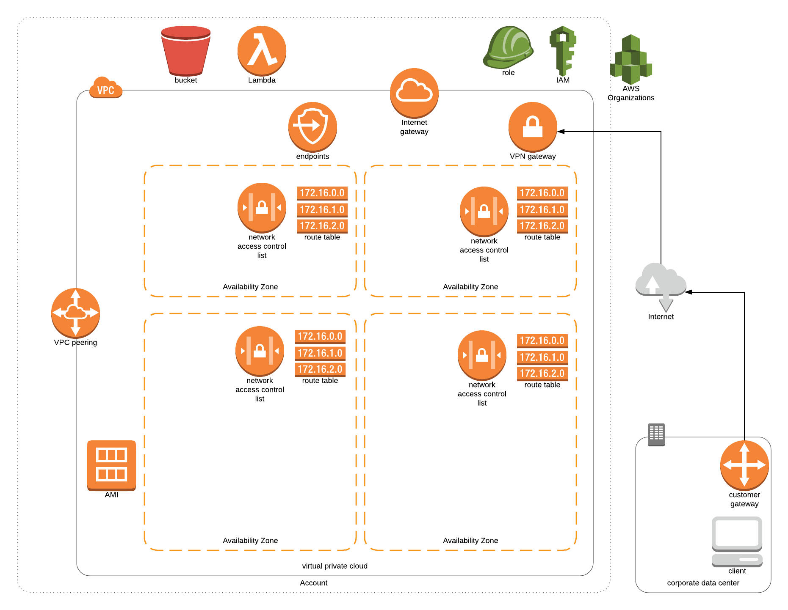

# workspaces-sortof

Below is a high level design for the environment. The environment will provide all configuration to implement a automated EC2 provising system based on ssh keys stored within a S3 bucket.



## prerequisites

A blank aws account
An IAM user created for terraform to use
An S3 bucket created for terraform to use for remote state

## customising to your needs:

```
git clone <https://github.com/benclancycr/workspaces-sortof.git>   
cd workspaces-sortof
vi vars.tf
```

## creating environment

```
git clone <https://github.com/benclancycr/workspaces-sortof.git>      
cd workspaces-sortof 
export AWS_ACCESS_KEY_ID="anaccesskey"
export AWS_SECRET_ACCESS_KEY="asecretkey"
terraform plan  
terraform apply  
```

## on-boarding process:

1) New Joiner: Create SSH pub/priv key pair on their laptop  
1.1) Key name should be in the following format 'firstname-surname'.pub  
2) New Joiner: pub key gets uploaded to S3 bucket  
3) Automation:  
 * 3.1) ec2-start lambda function turns on all EC2 instances at a predefinded time  
 * 3.2) ec2-create lambda function creates ec2 instances based on number of keys in S3 bucket  
 * 3.3) User-data on provising will pull down ssh key based on tag, allowing only one ssh key per EC2 instance.  

4) Connecting: ec2-user@firstname-surname.privatezone.tld